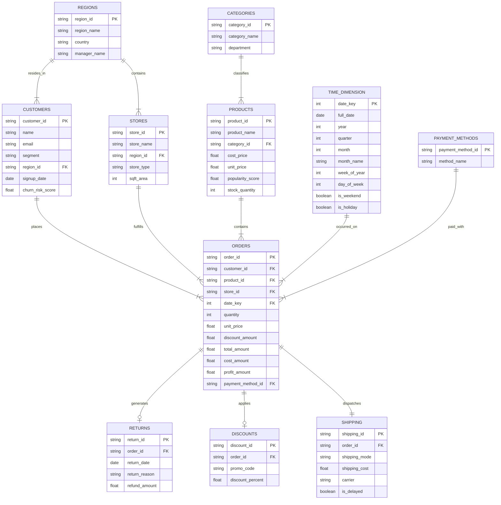

# Relational Dataset Schemas & ER Diagram

This document details the relational entity schema architecture and Entity-Relationship (ER) diagram for the Enterprise Retail Sales Analytics Platform.

---

## 📐 Entity-Relationship (ER) Diagram

---

## 📊 Data Dictionary & Relational Tables

### 1. `customers`
- **Primary Key**: `customer_id` (`CUST-000001` format)
- **Foreign Keys**: `region_id` -> `regions.region_id`
- **Attributes**: `name`, `email`, `segment` (Consumer, Corporate, Home Office), `signup_date`, `churn_risk_score` (Beta distribution $\alpha=2.0, \beta=5.0$).

### 2. `products`
- **Primary Key**: `product_id` (`PRD-01001` format)
- **Foreign Keys**: `category_id` -> `categories.category_id`
- **Attributes**: `product_name`, `cost_price`, `unit_price`, `popularity_score` (Pareto distribution $\alpha=1.16$), `stock_quantity`.

### 3. `orders` (Fact Table)
- **Primary Key**: `order_id` (`ORD-1000001` format)
- **Foreign Keys**:
  - `customer_id` -> `customers.customer_id`
  - `product_id` -> `products.product_id`
  - `store_id` -> `stores.store_id`
  - `date_key` -> `time_dimension.date_key`
  - `payment_method_id` -> `payment_methods.payment_method_id`
- **Calculated Line Metrics**:
  - $\text{total\_amount} = (\text{unit\_price} \times \text{quantity}) - \text{discount\_amount}$
  - $\text{cost\_amount} = \text{cost\_price} \times \text{quantity}$
  - $\text{profit\_amount} = \text{total\_amount} - \text{cost\_amount}$
